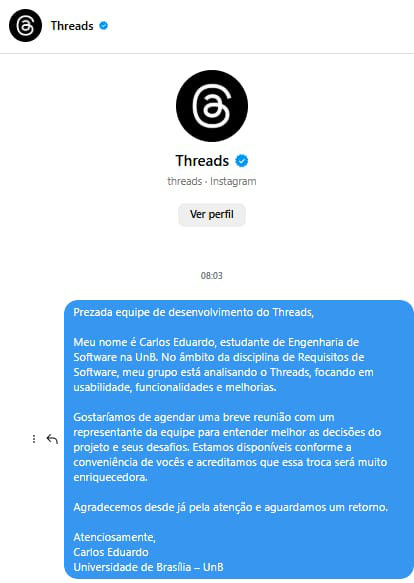

# Introdução

Ao alcançar a etapa de validação, que consiste em confirmar se o produto atende às expectativas do usuário, uma das estratégias adotadas para o projeto foi a comprovação informal. Trata-se de uma descrição em linguagem natural para que os clientes possam identificar possíveis problemas na formulação dos requisitos. No caso do Threads, entramos em contato com a equipe do aplicativo para obter a validação.

# Método de Comunicação

Para realizar a validação, foram utilizadas diferentes plataformas de comunicação. Como não encontramos um e-mail de contato disponível, a abordagem foi realizada por meio do Instagram, enviando uma mensagem direta para o perfil oficial do Threads.

A comunicação via Instagram foi escolhida por ser um canal acessível e direto, permitindo uma interação rápida com a equipe do aplicativo. A mensagem enviada apresentou uma breve explicação sobre o projeto e questionou sobre a possibilidade de obter um retorno que ajudasse na validação dos requisitos formulados.

A imagen 1  apresenta a mensagem enviada por essa plataforma. Todas foram encaminhadas no dia 25 de janeiro.

    
<strong>imagem 1 - Mensagem enviada via Instagram </strong>

  

  

    Autores: <a href="https://github.com/SamuelRicosta" target="_blank">Samuel Ribeiro.</a>

# Retorno

Até o momento da entrega do artefato (02/02/2025) não foram obtidas respostas de validação. Caso a equipe entre em contato por alguma rede social, será inserido neste artefato sua comprovação informal quanto ao que foi desenvolvido no projeto.

## Histórico de Versões

| **Versão** | **Data**   | **Descrição**              | **Autor(es)**                                      | **Revisor(es)**                                    |
| ---------- | ---------- | -------------------------- | -------------------------------------------------- | -------------------------------------------------- |
| 1.0        | 02/02/2024 | Criação do documento       | [Samuel Ribeiro](https://github.com/SamuelRicosta) | [Genilson Silva](https://github.com/GenilsonJrs)   |